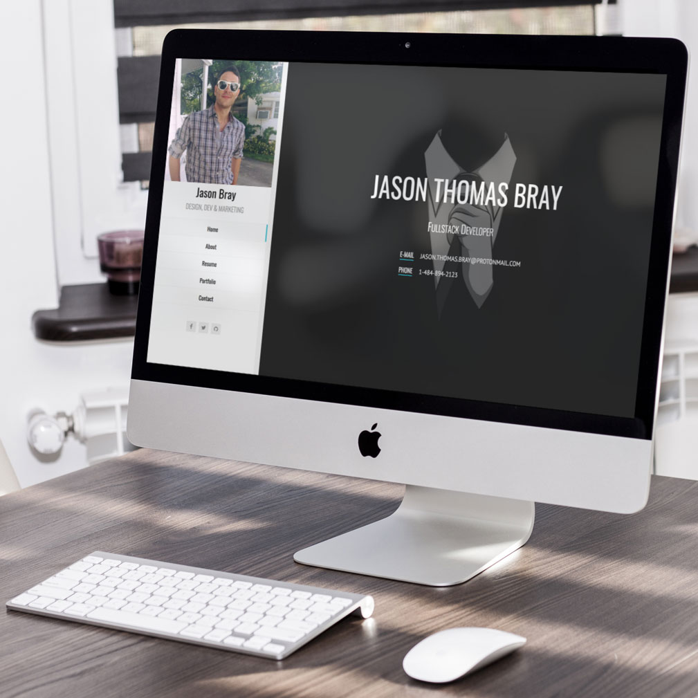

# Brilliant Resume

Brilliant Resume is a Grav theme designed for professionals to showcase their talent, work & experience.

## Demo Site
[https://jtbray.com](https://jtbray.com)

<!-- ## Skeleton (complete Grav CMS, plugins & theme) will be added after GPM acceptance -->
<!-- [https://github.com/jtbray/brilliant-resume-skeleton](https://github.com/jtbray/brilliant-resume-skeleton) -->

# Features

* Easy customization
* One-page layout
* Font Awesome 5
* Grav Forms Integration
* Mautic Integration
* Example Mautic form & JS
* Responsive Layout (Bootstrap v3.3.7)
* 3-d section transitions
* Sortable portfolio (optional)
    * Video or Image options
    * Filter based on tags

# Supported Page Templates

* Default
* Portfolio-item

# Installation

Brilliant Resume can be installed via the Grav Admin -> Themes or by GPM using the command `bin/gpm install brilliant-resume`

> Note: I recommend using the Grav Admin Plugin to easily configure all of the theme's settings.

* To manually install this theme, just download the zip version of this repository and unzip it under the following folder: `/your/site/grav/user/themes/brilliant-resume`

# Setup

If you want to set Brilliant Resume as the default theme, you can do so by following these steps:

* Using the Grav Admin Plugin (recommended): Themes -> Activate Brilliant Resume

or

* Navigate to `/your/site/grav/user/config`
* Open the **system.yaml** file
* Change the `theme:` setting to `theme: brilliant-resume`
* Save your changes
* Clear the Grav cache. The simplest way to do this is by going to the root Grav directory in Terminal and typing `bin/grav clear-cache`

Once this is done, you should be able to see the new theme on the frontend. Keep in mind any customizations made to the previous theme will not be reflected as all of the theme and templating information is now being pulled from the **brilliant-resume** folder.

# Configuration

The recommended way to edit content for your resume site is by using the Grav Admin Plugin, but this can also be accomplished via your page's markdown file.

* After activating Brilliant Resume theme, login using the Grav Admin Plugin & edit your homepage (or create a new homepage with the template type set to Default)
* Expand each section to view available configuration & editing options associated with each part of the site (these can also be set via the page's markdown file)
* To create your portfolio (optional):
    * Add a folder titled 'Portfolio' to your site root
    * Create a subpage in the portfolio folder with template type of 'Portfolio-item'
    * Use the inputs to provide details about each portfolio item (or edit the page's markdown)

* Contact Form Implementation
    
    * Using Grav's Forms plugin **[NEW]**
        * Create a page with "form" template
        * Add form MD as described by plugin
        * Disable form routing via form page admin => Advanced => Overrides => Routable = Disabled
        * Insert your form's url (ie. contact-form) in your home page admin field for 'Contact Form Slug'
        * example & additional instructions in `templates/partials/examples/grav-forms-contact-form-demo.md`

        **or**

    * Using custom HTML (ie. Mautic, Hubspot, Mailchimp, Typeform...)
        * copy & paste your code in your home page admin
        * Example contact form in `templates/partials/examples/mautic-contact-form.html`

* Mautic Integration
    * add your Mautic base url in your home page admin
    * Example focus item (exit intent & resume download button) in `templates/partials/examples/mautic-resume-download-modal.html`

* *TODO*
    * *improved tracking (for ajax portfolio pages)*